# Setup of the GoldenGate Replication

## Introduction

In this lab you will set up the actual configuration to define the replication from an Oracle database into a remote Kafka topic.

In the previous lab you got acquainted with the various components that constitute the lab environment: the Oracle database, the Apache Kafka setup and the GoldenGate console.  We'll now use the various services of the GoldenGate environment to configure the different steps in the replication process.


*Estimated Lab Time*: 20 mins

### Objectives

In this lab environment all components are on a single Linux Compute environment.  In reality, these components can be distributed across various machines and locations, even if they are very remote from one another.

We'll be performing the following tasks:

- Configure the **Database credentials** to connect to the source Oracle Database, and creation of a CheckPoint Table
- Set up the **Extract** process on the Oracle database, selecting all the tables from the SOURCE_APP schema to be replicated
- Set up the **Distribution** service to forward the transactions to a remote system
- Verify the **Receive** service is automatically set up on the remote (oggdaa) system
- Set up the **Replicat** service to inject the transactions into the Kafka topic corresponding to the source database table

### Prerequisites

This lab assumes you have:

- A Free Tier, Paid or LiveLabs Oracle Cloud account
- You have completed:

  - Lab: Prepare Setup (*Free-tier* and *Paid Tenants* only)
  - Lab: Environment Setup
  - Lab: Discover the environment

## Task 1: Configuring the Database Credentials

1. Open the GoldenGate Service Manager on port 10000

    In the previous step you already logged in to this console.

2. Select the **oracledb** Deployment menu in the left navigation bar

    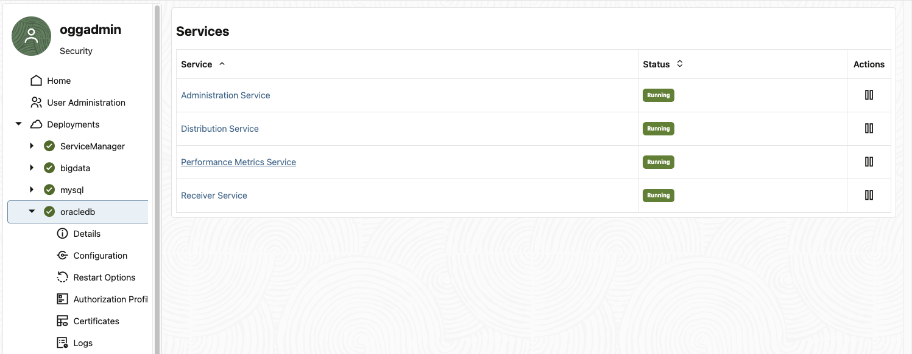

    You see the four services associated with the Oracle DB Deployment

3. Select the OracleDB Administration service

    You have to log in again, using the same credentials as before :
    - user = oggadmin
    - password = oggadmin

    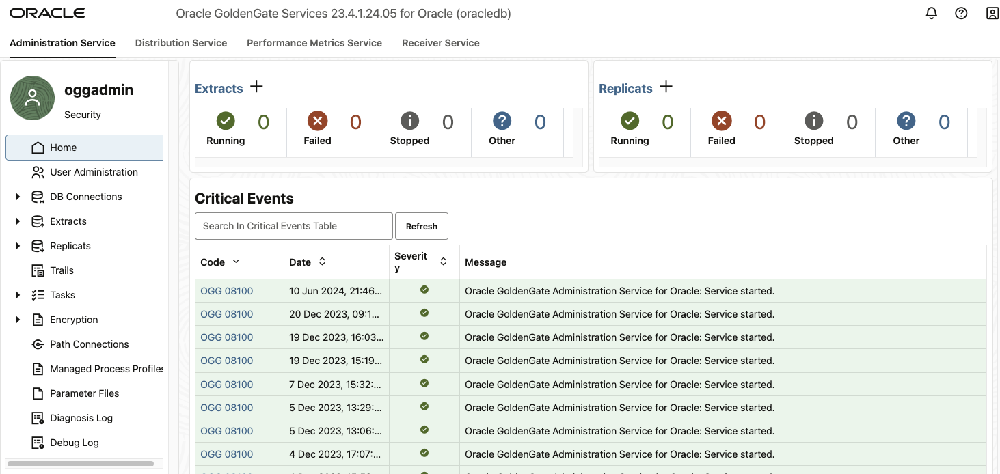

4. Now select the **DB Connections** item in the left menu bar

    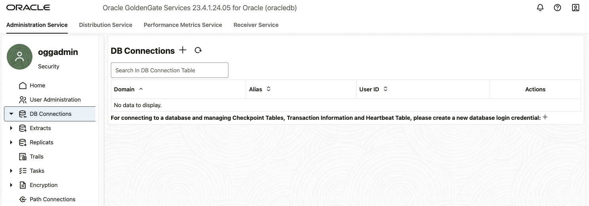

5. Create a new Connection by clicking the **+** icon

    Now you can enter the credentials for the connection from GoldenGate to the database we already have up and running in the environment
    - *Credentials Domain*: OracleGoldenGate
    - *Credentials Alias*: **OGG_CAPTURE**
    - *User ID*: **C##GGADMIN@ORCLCDB**
    - *Password*: **Welcome#123**
    - *Verify Password*: **Welcome#123**
    - Click the **Submit** button

    

    - You can see a new credential has appeared as we defined it.

6. Test the connection by clicking the arrow icon besides the new credential:

    

    You can see the login takes place, and the section *TRANDATA* appears on the screen.

    **Troubleshooting**: In case you get an error when testing the connection to the database, double-check your listener configuration is set up correctly, as already explained in the *Discover the Environment section*:

    - In the terminal window, connect to the database as system: ```sqlplus system/Welcome#123 as sysdba```
    - configure the listener: ```alter system set LOCAL_LISTENER='' scope=both;```
    - If you had an error stating that the password has expired ("ORA-28002 The Password Will Expire ..." or "ORA-28001 The Password has expired"), run the following command:

        ```sql
        <copy>
        sqlplus alter user C##GGADMIN identified by Welcome#123;
        </copy>
        ```

    - exit sqlplus with ```end```
    - restart the listener with ```lsnrctl stop``` followed by ```lsnrctl start```

7. We now need to add a TRANDATA table to the database to acquire the transaction records in the database.
    - Click on the **+** symbol besides the *TRANDATA Information* title

        

    - Enter the below parameters:

      - *Schema Name*: **ORCLPDB1.SOURCE_APP**
      - Select the **All Columns** checkbox
      - All other parameters remain the default ones
    - Click the **Submit** button

        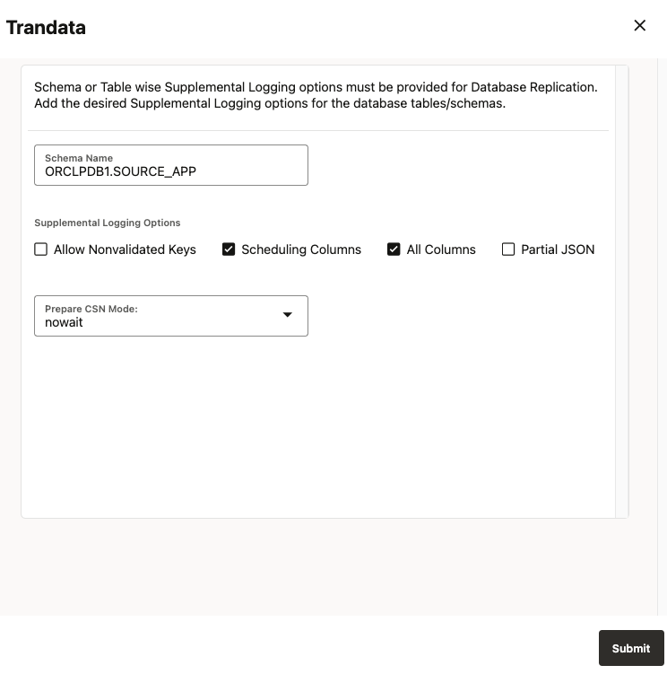

8. We can now check the tables in the schema specified:

    - In the search box of the *TRANDATA* section, type: **ORCLPDB1.SOURCE_APP**
    - click the search icon besides the box

        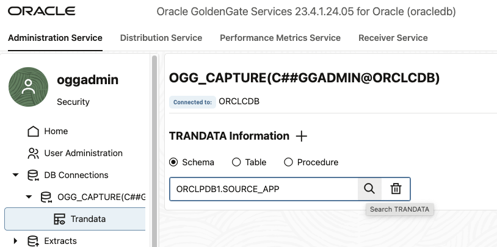

    - You can see there is one table enabled for replication in this schema.

         

This concludes the configuration of the Credentials.

## Task 2 : Configure the Extract process from the source Oracle Database

1. Select the  **Extracts** topic in the left-side menu

    

2. Create a new **Extract**

    - Click the **+** icon of the **Extracts** box as highlighted in the picture above
    - Select the *Extract Type* **Integrated Extract**
    - *Process Name*: **E_ORACLE**
    - Click **Next** to continue

    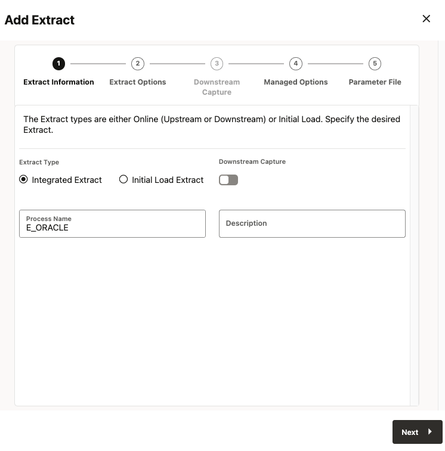

3. Enter the following Extract Options:

    - *Credentials Domain*: **OracleGoldenGate**
    - *Credentials Alias*: **OGG_CAPTURE**
    - *Register to PDBs*: **ORCLPDB1**
    - *Extract Trail - Name*: **ex**

    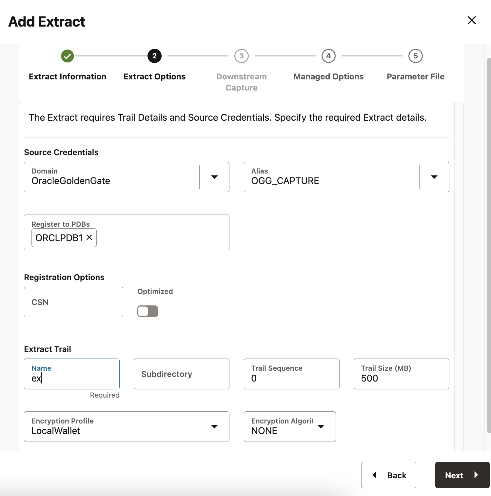

4. Click on **Next** to advance to the *Managed Options* screen:

    - Accept the default parameters and click the **Next** button to continue

    

5. This leads you to the **Parameter File** screen.

    - Complete the config by adding the below line to the config:

      ```sql
      <copy>TABLE ORCLPDB1.SOURCE_APP.*;</copy>
      ```

    - Click the **Create and Run** button

        

6. You will be returned to the Overview screen, with the status still showing stopped while the creation of the extract is in progress:

    

7. If all goes well, after a few seconds the icon will turn to green *Running*, indicating the creation of the extract succeeded.

    

8. You can click on the name of the extract **E_Oracle** to see more details, for example the statistics.  As nothing is happening on the Oracle database yet, we see no records yet.

    

This concludes the configuration of the Extract.

## Task 3: Set up the Distribution service

In this step we'll set up the **Distribution** service that will send the transactions to the remote system.  In this case of course the receiving service will also run on the test environment, but in a real-world implementation this process could run very far away.

Before we start the actual configuration we'll check the port on which the oggdaa (Distributed Transactions and Analytics) **Receiver** service is running, as this will be our target.

1. Navigate to the **GoldenGate Service Manager** running on port 10000

2. Select the **oggdaa** Deployment type - Distributed Applications and Analytics

    

3. While you hover over the oggdaa **Receiver Service** link, you can see at the bottom of the screen that this service is listening on port **10403**.  This will be our destination for the Distribution setup.

    Now we'll navigate back to the **oracledb** deployment

4. Select the **oracledb** deployment again

    

5. Select the **Distribution Service**

    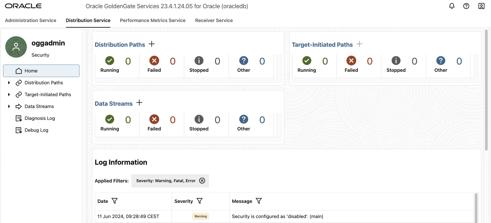

6. Click on the **+** sign besides the **Distribution Paths** to configure a new Distribution process

    Enter the following parameter:

    - *Path Name*: **ORA2KAFKA**

    and click on **Next**

    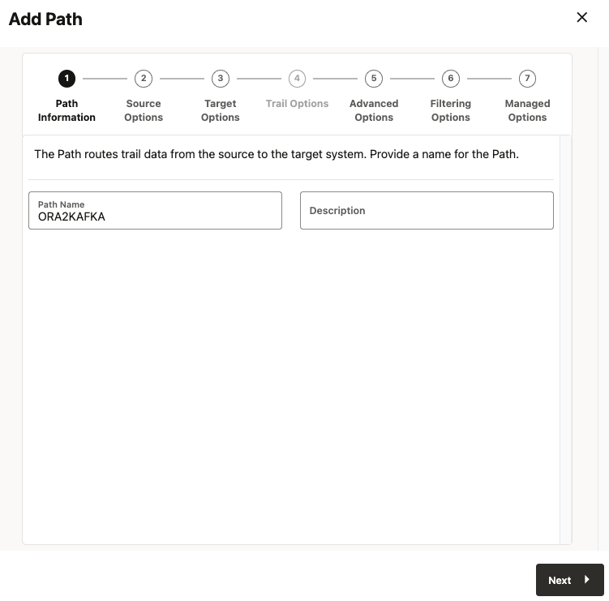

7. Enter the **Source Options**:

    - *Source*: **E_ORACLE**
    - *Trail Name*: **ex**

    and click on Next

    

8. Enter the **Target Options**:

    - *Target protocol*: **ogg**
    - *Target Type*: **Receive Service**
    - *Target*: **localhost**
    - *Port Number*: **10403**
    - *Trail Name*: **rt**

    Leave the other parameters as the default values provided and click **Next**

    

9. Leave the parameters on the following screens as is

    - Accept the default parameters for the screens **Advanced Options**, **Filtering Options** and **Managed Options**
    - At the, select **Create Path and Run**

10. You'll be returned to the home screen of the service, with the new Distribution being created.  After a few seconds the icon should show as steady green :

    

    - To see the details of the Distribution Path, click on the blue title **Distribution Paths**

    

Congratulations, you configured the **Distribution** service to send out the transactions remotely

## Task 4 : Check the Receive service on the oggdaa Deployment

Because you already configured the Distribution service specifying another GoldenGate environment Receiver service as a target, the receiving end will be configured by default.

We'll simply check if this configuration is visible on the receiving end of the Distributed Application and Analytics deployment.

1. Navigate back to the overall **GoldenGate Service Manager** running on port 10000

2. Select the **oggdaa** deployment

3. Click on the **Receiver Service** with port 10403

    

4. You can see that the same configuration we already configured in the Distribution service of the **oracledb** deployment is also visible here in the **oggdaa** deployment Receive service:

    

No further actions are required on the receiving end.

## Task 5 : Configure the Replicat service to Kafka

As we are receiving transactions in the **oggdaa** deployment, we can use a **Replicat** service to insert them into another destination, in this case we'll be using a Kafka system as a target.

1. Navigate to the Home screen of the service

2. Click on the **Administrative Service** tab on the top of the screen

3. Click on the **+** sign of the **Replicat** section

    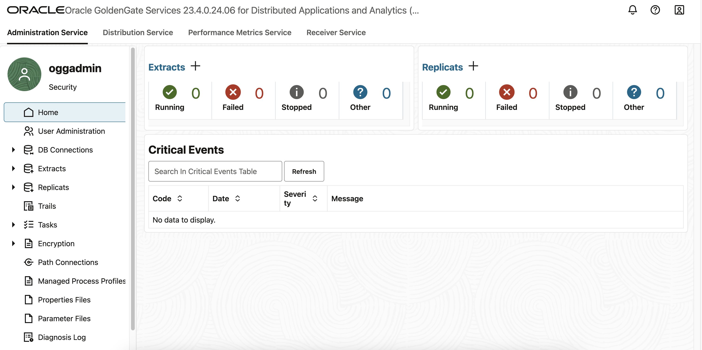

4. Configure the **Add Replicat** screen:
    - Select the *Replicat Type* = **Classic Replicat**
    - Set *Process Name*: **R_KAFKA**
    - Click **Next** to continue

    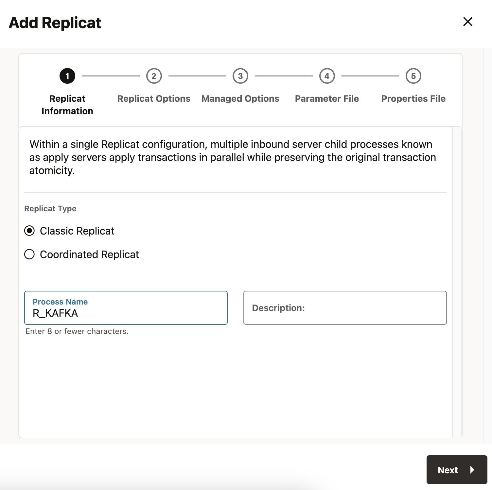

5. We'll now configure the Replicat Options with following parameter values:

    - 
    - *Replicat Trail Name*: **rt**
    - *Target*: **Kafka**
    - Click **Next** to continue

    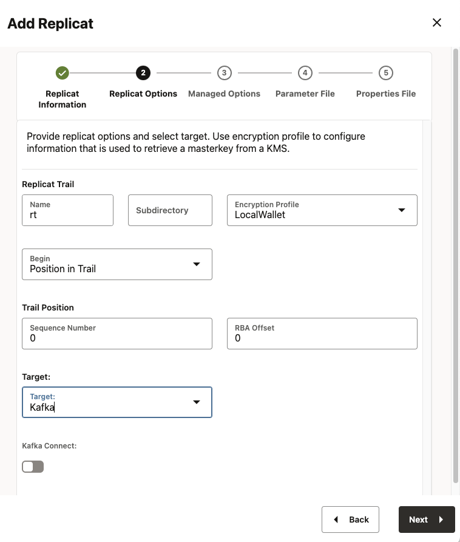

6. Leave all parameters of the **Managed Options** screen as per the default and click **Next**

7. Configure the Replicat Parameters: replace the 2nd line of the parameter file with the below value

    ```sql
    <copy>MAP ORCLPDB1.SOURCE_APP.*, TARGET TARGET_APP.*;</copy>
    ```

8. Click **Next** to continue

    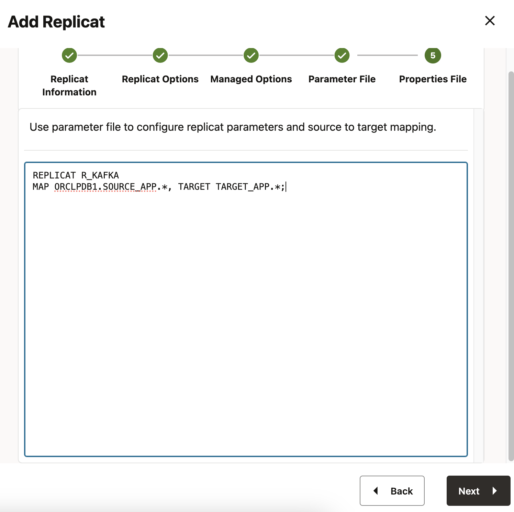

9. Configure the Properties file

    In the default properties file you can see 3 locations that need to be filled in as a minimum (marked as **TODO** in the text): the Kafka properties file, the Name resolving template, and the Kafka class path.

    Replace the parameter file with the below text, with the 3 placeholders filled in:

    ```param
    # Properties file for Replicat R_KAFKA
    #Kafka Handler Template
    gg.handlerlist=kafkahandler
    gg.handler.kafkahandler.type=kafka

    gg.handler.kafkahandler.kafkaProducerConfigFile=/home/oracle/scripts/kafka_producer.properties

    gg.handler.kafkahandler.topicMappingTemplate=${tableName}

    gg.handler.kafkahandler.keyMappingTemplate=${primaryKeys}
    gg.handler.kafkahandler.mode=op
    gg.handler.kafkahandler.format=json
    gg.handler.kafkahandler.format.metaColumnsTemplate=${objectname[table]},${optype[op_type]},${timestamp[op_ts]},${currenttimestamp[current_ts]},${position[pos]}

    gg.classpath=/opt/kafka/libs/*
    jvm.bootoptions=-Xmx512m -Xms32m
    ```

    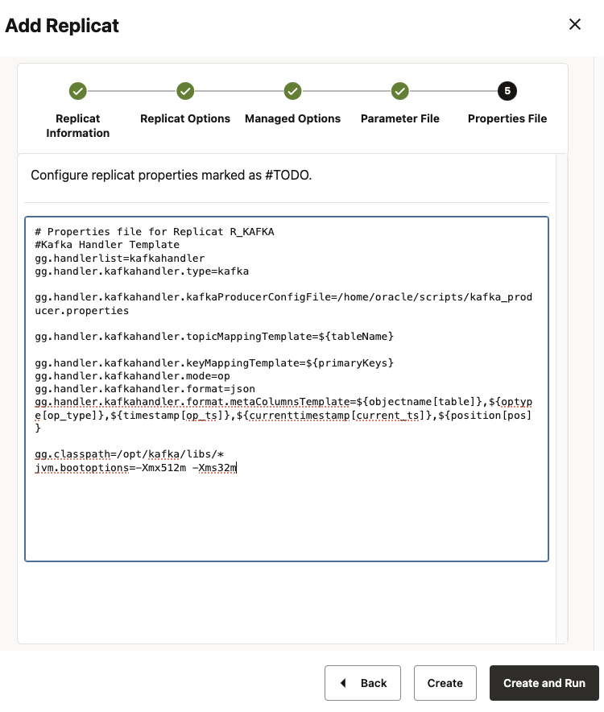

10. Click the **Create and Run** button to finalize the creation of the Replicat

11. Validate the creation finishes without errors

- After a few seconds you'll see a green "Running" icon appear:

    

You finalized the setup of the replication !

## Summary

The objectives of the lab was to familiarize you with the process to create data replication objects that will allow you to replicate data real-time using GoldenGate Microservices.

Oracle GoldenGate offers high-performance, fault-tolerant, easy-to-use, and flexible real- time data streaming platform. It easily extends customers’ real-time data integration architectures without impacting the performance of the source systems and enables timely business insight for better decision making.

You may now **proceed to the next lab**.

## Learn More

- [GoldenGate Microservices](https://docs.oracle.com/en/middleware/goldengate/core/19.1/understanding/getting-started-oracle-goldengate.html#GUID-F317FD3B-5078-47BA-A4EC-8A138C36BD59)

## Acknowledgements

- **Author** - Jan Leemans, December 2023
- **Contributors** - Carmelo Millan
- **Last Updated** - Jan Leemans, August 2024
